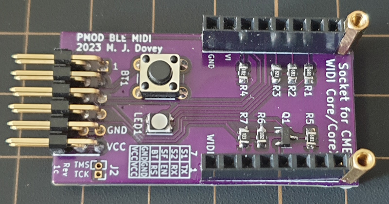

# pmod_midi
#### PMOD Adapter for the CME Widi Core BLE MIDI module

 

Kicad files for a PCB adapter board/shield to allow the [CME Widi Core module](https://www.cme-pro.com/widi-core/) to be connected to development boards which use the [Digilent PMOD connector](https://digilent.com/shop/about-system-boards-and-components/).

| PMOD Pin | Core Pin | Notes                                                        |
| -------- | -------- | ------------------------------------------------------------ |
| 1        | 1 (TX)   | Connects directly to Widi Core TX pin for MIDI over UART     |
| 2        | 11 (RX)  | Connects directly to Widi Core RX pin for MIDI over UART     |
| 3        | 6 (ON)   | Connects to Widi Core ON pin via pull down resistor. Active high to enable the Widi Core module. |
| 4        | 12 (RS)  | Connects to Widi Core RS pin. Active low reset.              |
| 7        | 16 (S1)  | Connects to Widi Core S1 pin. Bluetooth connection status (0 = Not connected, 1 = Connected). |
| 8        | 15 (S2)  | Connects to Widi Core C2 pin. Bluetooth role (0 = peripheral, 1 = central) |
| 9        | 13 (SF)  | Connects to Widi Core SF pin. Baud rate (0 = 31.25 Kb/s, 1 = 100 Kb/s). Requires reset cycle to execute change. |
| 10       | 14 (BT)  | If 1, shorts Widi Core BT pin to ground - simulating button press. |

The board also has a push button which shorts Widi Core pin 14 (BT) to ground (for factory reset and bluetooth role change), and an RGB LED, powered by Widi Core pins 2 (LB), 3(LG), 4 (LR) and 5(V3), for status information (see [CME Widi Core datasheet](https://www.cme-pro.com/wp-content/uploads/2022/10/widiCore-Doc-v1.3.pdf), page 9). An optional 0.5 inch pitch header can provide access to the Widi Core pins 9 (TMS) and 10 (TCK)

The [BOM](./kicad/pmod_midi_bom.md) includes sockets to allow the CME Widi Core (or the Core N/XN with suitable headers) to be inserted and removed. Alternatively the Core N/XN can be hard soldered for example using 0.1 inch pitch header pins.

